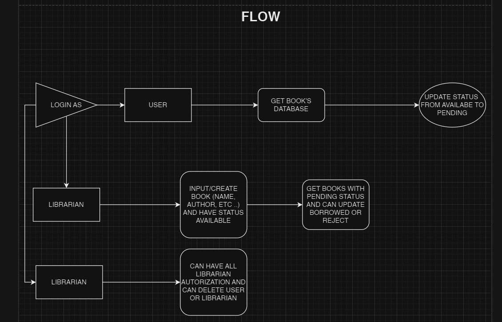
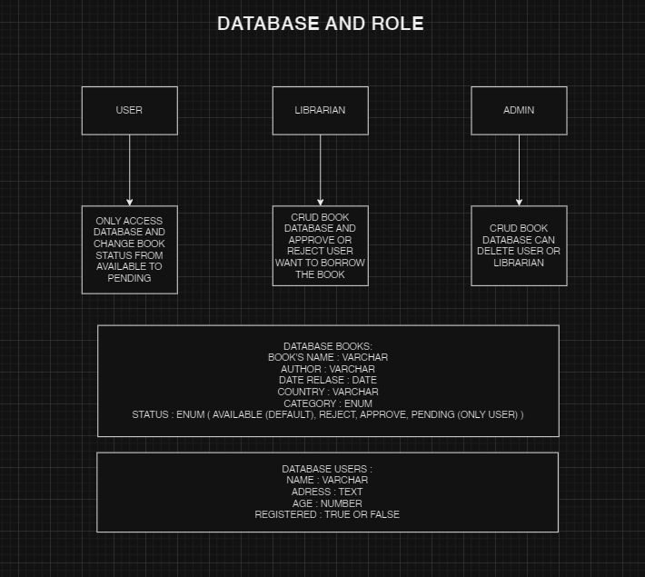
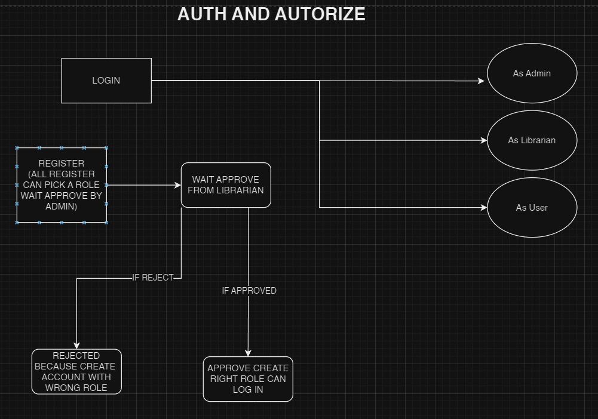

# THIS IS AN EXAMPLE LIBRARY DATABASE

## ABOUT APP
this is an example of a library API that uses authentication and authorization. There are several authentications and authorizations that I created such as admin, librarian and user and they have their respective authorizations, you can see them in the following flowchart

## FLOW CHART

## API LINK ADMIN

## API LINK LIBRARIAN

## API LINK USER

## OPENAPI LINK
https://week-11-hill-man-1-production.up.railway.app/api-docs
## DEPLOYMENT LINK
https://week-11-hill-man-1-production.up.railway.app/

